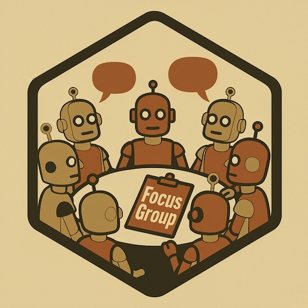

# FocusGroup: simulated moderated discussion for research design




[](https://github.com/asanaei/FocusGroup/actions/workflows/R-CMD-check.yaml)
[](https://asanaei.github.io/FocusGroup/)
[](https://lifecycle.r-lib.org/articles/stages.html#experimental)
[](https://asanaei.github.io/FocusGroup/)

## Overview

FocusGroup runs a moderated group discussion in which the participants are
language models. A moderator poses questions, participants take turns according
to a turn-taking rule, and the package records who said what, in which phase, at
what token cost. It is built on [LLMR](https://asanaei.github.io/LLMR/).

The purpose is design-stage research: piloting a moderator guide, finding the
questions that confuse people before a study is fielded, comparing turn-taking
rules, and watching how one turn shapes the next. A transcript is a synthetic
artifact. It is not public opinion, and a synthetic participant does not stand
in for a demographic group. Treat the output as material for refining an
instrument, not as evidence about people, unless you have checked it against
human data and say so.

The controls run from a one-line wrapper for a first run to direct command of
the agent and orchestrator classes. Personas, turn-taking, prompts, and the
analysis are each separable, so a naive user gets a sensible default and a
careful one can change a single piece without rewriting the rest.

## Key Features

-   **Agents**: participants and a moderator (`FGAgent`) built from
    researcher-supplied demographics, survey responses, or a direct persona
    description. By default the persona states those facts and lets the model
    decide what they imply; it draws no scripted dispositions from a demographic
    label. Each agent can carry its own LLM configuration.
-   **Turn-taking**: choose how the next speaker is picked through the `ConversationFlow` class:
    -   `RoundRobinFlow`: a fixed order.
    -   `ProbabilisticFlow`: propensity scores that adjust as the discussion goes.
    -   `DesireBasedFlow`: each participant rates its own "desire to talk" and the keenest speaks.
-   **Phases**: the `FocusGroup` class runs the discussion through a `question_script` of phases (opening, icebreaker, engagement, exploration, closing) and moderator actions.
-   **Analysis**: the `FocusGroup` class reports participation and conversation statistics; the `analyze_focus_group()` wrapper adds topic modeling, TF-IDF, readability, and thematic analysis over the transcript.
-   **Prompts**: defaults ship in `get_default_prompt_templates()`. Wording that shapes agent behavior, including how a participant answers if asked whether it is an AI, is exposed through options so you can change it without editing the package.
-   **Provider layer**: all model calls go through `LLMR`, so any provider, model, sampling, or logging setting LLMR understands works here unchanged.
-   **Point-and-Click GUI**: `run_focus_studio()` opens a Shiny app with three tabs: Run a focus group (live moderated session), Analyze (load a saved transcript and read its participation and word statistics), and Continuation experiment (extend a saved session under new conditions).

## Status

The package is experimental. The two classes at its center, `FGAgent` and
`FocusGroup`, are meant to stay stable; the functions and methods around them
are still moving.

## Installation

```r
install.packages("LLMR")   # from CRAN
remotes::install_github("asanaei/FocusGroup")
```

The analysis helpers draw on a few text-mining packages:

```r
install.packages(c("ggplot2", "quanteda", "quanteda.textstats",
                   "topicmodels", "tidytext"))
```

Set the API key for your provider as an environment variable (for OpenAI through
`LLMR`, `OPENAI_API_KEY`). Do not write keys into package code or the Shiny app.

## Quick Start

### 0. Point-and-click with `run_focus_studio()`

If you prefer a graphical interface, launch the bundled Shiny app:

```r
library(FocusGroup)
run_focus_studio()
```

The app has three tabs. **Run a focus group** starts a fresh moderated session
live and offers it as a downloadable `.rds`. **Analyze** loads a saved transcript
and reads its participation and word statistics without an API key.
**Continuation experiment** loads a saved session and extends it under new
conditions.

### 1. Simple Focus Group Simulation using `run_focus_group`

The `run_focus_group` function is a high-level wrapper to quickly set up and run a simulation.

```r
library(FocusGroup)
library(LLMR) # For llm_config

# Ensure OPENAI_API_KEY is set in your environment
# Sys.setenv(OPENAI_API_KEY = "your-openai-api-key")
if (Sys.getenv("OPENAI_API_KEY") == "") {
  stop("Please set your OPENAI_API_KEY environment variable.")
}

# Define LLM configuration for agents
llm_config_agents <- LLMR::llm_config(
  provider = "openai",
  model = "gpt-4o-mini", # Or your preferred model
  temperature = 0.7,
  max_tokens = 200
)

# Run a basic focus group
# `turns_per_phase` will generate a generic script structure.
# The moderator prompts will adapt to the topic and phase.
result <- run_focus_group(
  topic = "The impact of remote work on team collaboration",
  participants = 4,
  turns_per_phase = c(Opening = 1, Icebreaker = 2, Engagement = 5, Exploration = 6, Closing = 1),
  llm_config = llm_config_agents, # Used for all agents and admin tasks if not specified otherwise
  seed = 110,
  verbose = TRUE
)

# Access the conversation log
print("First 5 turns of the conversation:")
print(head(result$conversation, 5))

# View basic statistics
print("Basic conversation statistics:")
print(result$basic_stats$speaker_stats)

# View summary
print("Focus group summary:")
cat(result$summary)
```

### 2. More Detailed Simulation Setup (using R6 classes directly)

For more control, you can instantiate the R6 classes directly.

```r
library(FocusGroup)
library(LLMR)

# Sys.setenv(OPENAI_API_KEY = "your-openai-api-key") # Ensure API key is set

# a. Define LLM Configuration
llm_conf <- LLMR::llm_config(
  provider = "openai",
  model = "gpt-4o-mini",
  temperature = 0.7
)

# b. Create Agents (using create_diverse_agents or manually)
# `create_diverse_agents` generates diverse demographics and basic personas.
# It also creates a moderator.
all_agents_list <- create_diverse_agents(
  n_participants = 3,
  llm_config = llm_conf
)
# The list needs to be named by agent ID for FocusGroup class
all_agents_named <- setNames(all_agents_list, sapply(all_agents_list, function(a) a$id))
moderator_id <- "MOD" # Default ID from create_diverse_agents

# c. Define a Custom Question Script
custom_script <- list(
  list(phase = "opening"),
  list(phase = "icebreaker_question", text = "What's one word that describes your ideal weekend?"),
  list(phase = "engagement_question", text = "How do you typically spend your weekends?"),
  list(phase = "exploration_question", text = "What makes a weekend truly relaxing or fulfilling for you?"),
  list(phase = "closing")
)

# d. Choose a Conversation Flow
# desire_flow <- DesireBasedFlow$new(agents = all_agents_named, moderator_id = moderator_id)
round_robin_flow <- RoundRobinFlow$new(agents = all_agents_named, moderator_id = moderator_id)


# e. Create FocusGroup Object
fg_manual <- FocusGroup$new(
  topic = "Weekend Preferences and Activities",
  purpose = "To understand how people like to spend their weekends.",
  agents = all_agents_named,
  moderator_id = moderator_id,
  turn_taking_flow = round_robin_flow, # Using round robin for this example
  question_script = custom_script,
  llm_config_admin = llm_conf # For summaries etc.
)

# f. Run Simulation
fg_manual$run_simulation(verbose = TRUE)

# g. Analyze
conversation_df_manual <- dplyr::bind_rows(lapply(fg_manual$conversation_log, as.data.frame))
print("Manually setup conversation (first 5 turns):")
print(head(conversation_df_manual, 5))

summary_manual <- fg_manual$summarize(summary_level = 1)
cat("\nSummary from manual setup:\n", summary_manual, "\n")
```

## Main Classes

### `FGAgent`
Represents an individual participant or moderator.
-   **Key Fields**: `id`, `persona_description`, `communication_style_instruction`, `model_config`, `is_moderator`.
-   **Key Methods**:
    -   `initialize(id, agent_details, llm_config, is_moderator)`: Creates an agent. `agent_details` can include `direct_persona_description`, `demographics`, `survey_responses`, `communication_style`.
    -   `generate_utterance(...)`: Generates text based on context and prompts.
    -   `get_need_to_talk(...)`: (Used by `DesireBasedFlow`) Queries LLM for agent's desire to speak.

```r
# Example FGAgent creation
participant_details <- list(
  direct_persona_description = "A 35-year-old software engineer who enjoys hiking and is concerned about data privacy.",
  communication_style = "analytical and tends to ask clarifying questions",
  demographics = list(age = 35, occupation = "Software Engineer")
)
# llm_conf defined earlier
agent1 <- FGAgent$new(id = "P1", agent_details = participant_details, llm_config = llm_conf)
```

### `FocusGroup`
Manages the overall simulation, conversation flow, logging, and analysis.
-   **Key Fields**: `topic`, `purpose`, `agents` (named list), `moderator_id`, `conversation_log`, `turn_taking_flow`, `question_script`, `prompt_templates`.
-   **Key Methods**:
    -   `initialize(...)`: Sets up the focus group.
    -   `run_simulation(num_turns, verbose)`: Executes the simulation.
    -   `advance_turn(current_turn_number, verbose)`: Core logic for a single moderator-participant exchange.
    -   `summarize(summary_level, ...)`: Generates an LLM-based summary of the conversation.
    -   `analyze()`: Provides basic conversation statistics.
    -   `analyze_topics()`, `analyze_tfidf()`, `analyze_readability()`, `analyze_themes()`: Various detailed analysis methods.
    -   Plotting methods like `plot_participation_timeline()`, `plot_word_count_distribution()`, etc.

### `ConversationFlow` (and subclasses)
Defines how the next speaker is chosen.
-   Base class: `ConversationFlow`
-   Implementations:
    -   `RoundRobinFlow`: Cycles through participants.
    -   `ProbabilisticFlow`: Uses weighted probabilities based on speaking history and base propensities.
    -   `DesireBasedFlow`: Uses LLM to assess each participant's "desire to talk".
-   Created via `create_conversation_flow(mode, agents, moderator_id, flow_params)` or by direct instantiation.

## Advanced Usage: Working with Survey Data (e.g., ANES)

The package is designed to allow agent personas to be informed by survey data. The `create_diverse_agents` function (and by extension, `run_focus_group`) can accept `demographics` and `survey_responses` data frames.

**Key Idea**: If `direct_persona_description` is NOT provided in `agent_details`, `FGAgent$new` (via `create_diverse_agents` and its internal `generate_persona` function) builds the persona from the supplied data. It will:
1.  Use the `demographics` data frame for basic demographic facts.
2.  Iterate through columns in the `survey_responses` data frame for a given agent.
3.  For each survey variable (column):
    *   Retrieve the question text (variable label from Haven attributes, e.g., `attr(column, "label")`).
    *   Retrieve the textual representation of the coded answer (value label from Haven attributes, e.g., by using `haven::as_factor()` then `as.character()`, or by looking up `attr(column, "labels")`).
    *   Incorporate this "Question: ..., Answer: ..." information into the `persona_description` passed to the LLM.


## Customizing Prompts

You can tailor the LLM's behavior by modifying the default prompt templates.
```r
# Get the list of default prompts
default_prompts <- get_default_prompt_templates()

# Modify a specific prompt, e.g., for the moderator's opening
default_prompts$moderator_opening <- "Hello everyone, and a very warm welcome! Today we're diving into {{topic}}. Our goal is {{focus_group_purpose}}. Let's make this a great discussion."

# When creating your FocusGroup object:
# fg <- FocusGroup$new(
#   ...,
#   prompt_templates = default_prompts,
#   ...
# )
```

## Analysis Capabilities

The `FocusGroup` class offers several built-in analysis methods:
-   `analyze()`: Basic statistics (turn counts, word counts).
-   `analyze_topics(num_topics = 5, ...)`: LDA topic modeling.
-   `analyze_tfidf(top_n_terms = 10, ...)`: Term Frequency-Inverse Document Frequency.
-   `analyze_readability(measures = "Flesch", ...)`: Readability scores.
-   `analyze_themes(...)`: LLM-assisted thematic analysis.
-   `analyze_participation_balance(...)`, `analyze_response_patterns(...)`, `analyze_question_patterns(...)`, `analyze_key_phrases(...)`: More specialized text and interaction analyses.

The `analyze_focus_group()` wrapper function provides a convenient way to run several of these analyses at once.

## Visualizations

The `FocusGroup` class also includes plotting methods:
-   `plot_participation_timeline()`
-   `plot_word_count_distribution()`
-   `plot_participation_by_agent()`
-   `plot_turn_length_timeline()`

These are also accessible via the `plots` element in the output of `analyze_focus_group()`.

## Contributing

Contributions, bug reports, and feature requests are welcome! Please open an issue or submit a pull request on the [GitHub repository](https://github.com/asanaei/FocusGroup).

## License

This project is licensed under the MIT License - see the `LICENSE` file for details.
